# Le Petit Davinci API - Architecture Documentation
# Mermaid Diagrams for Backend System

---
## 1. System Architecture Overview
---

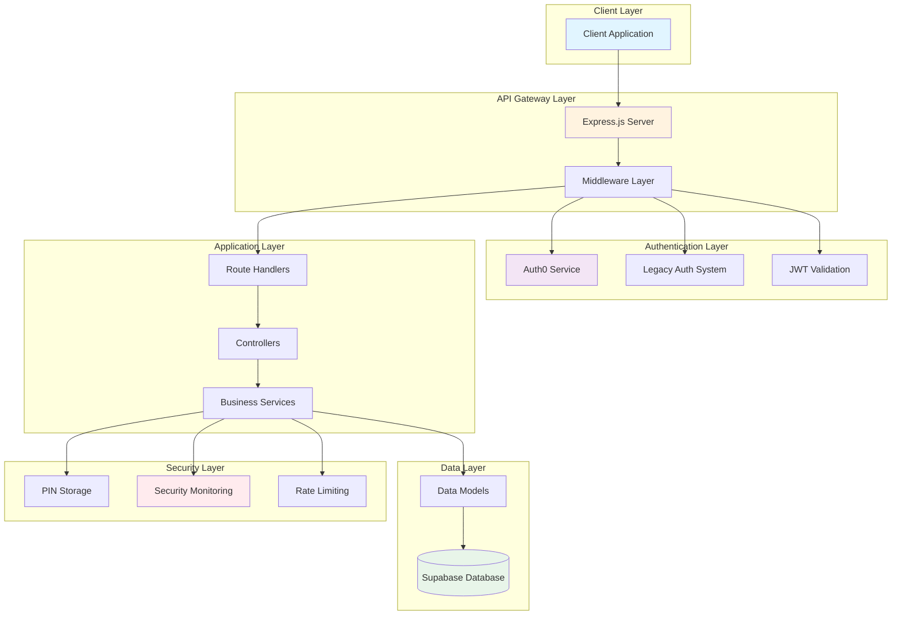

---
## 2. Request Flow Pipeline
---

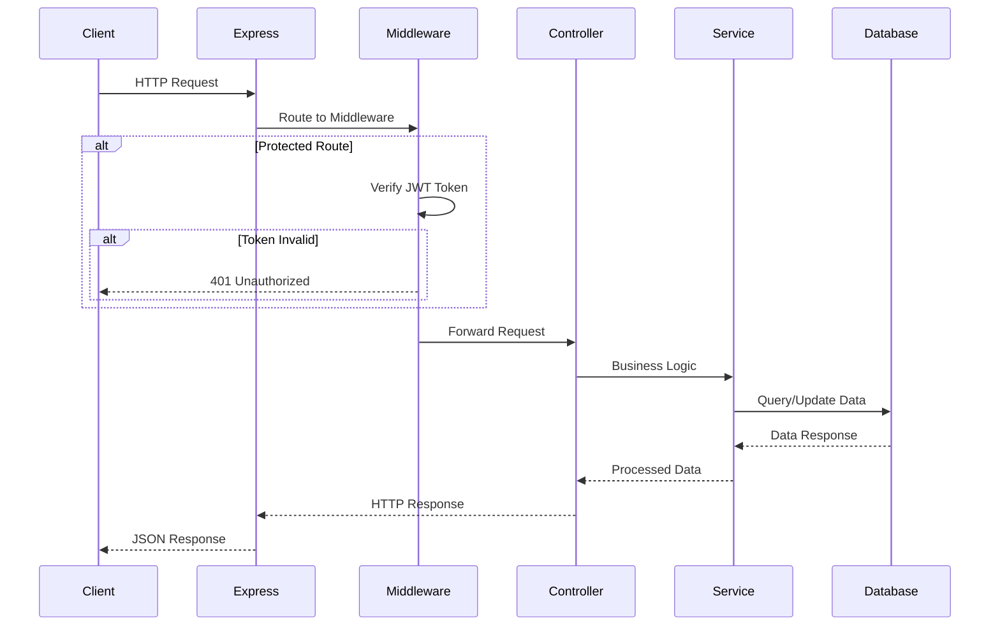

---
## 3. Legacy Authentication Flow (Multi-Step)
---

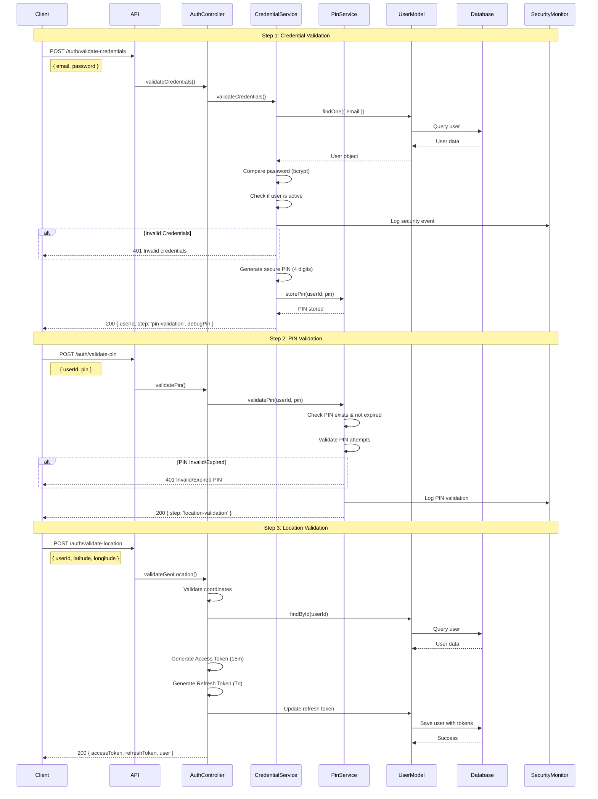

---
## 4. Auth0 Authentication Flow
---

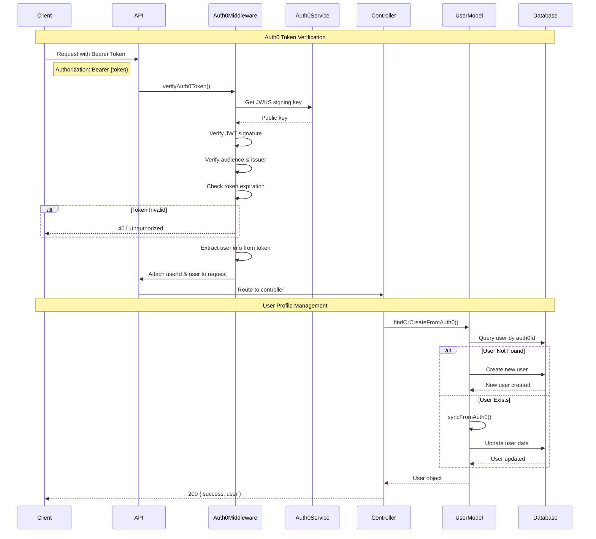

---
## 5. Token Refresh Flow
---

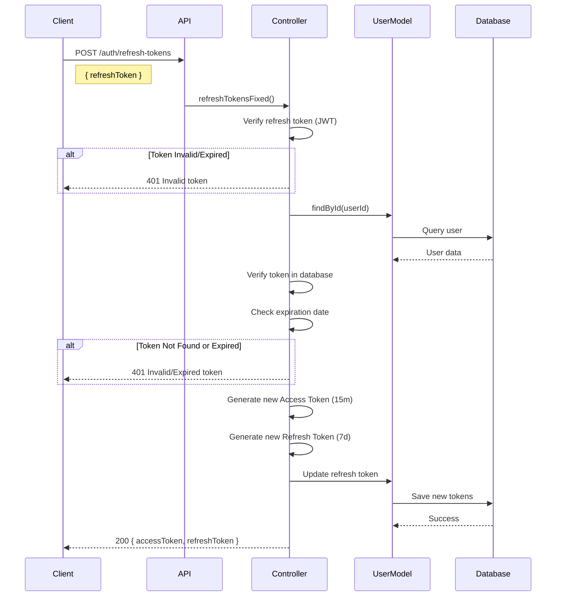

---
## 6. Security Monitoring System
---

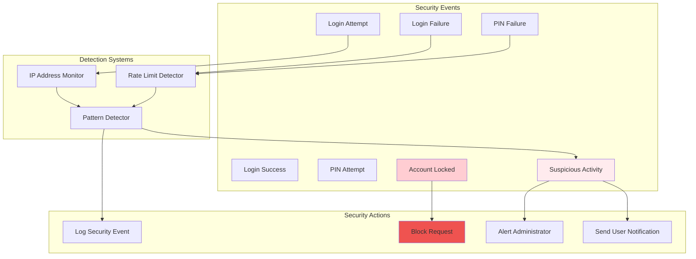

---
## 7. PIN Management System
---

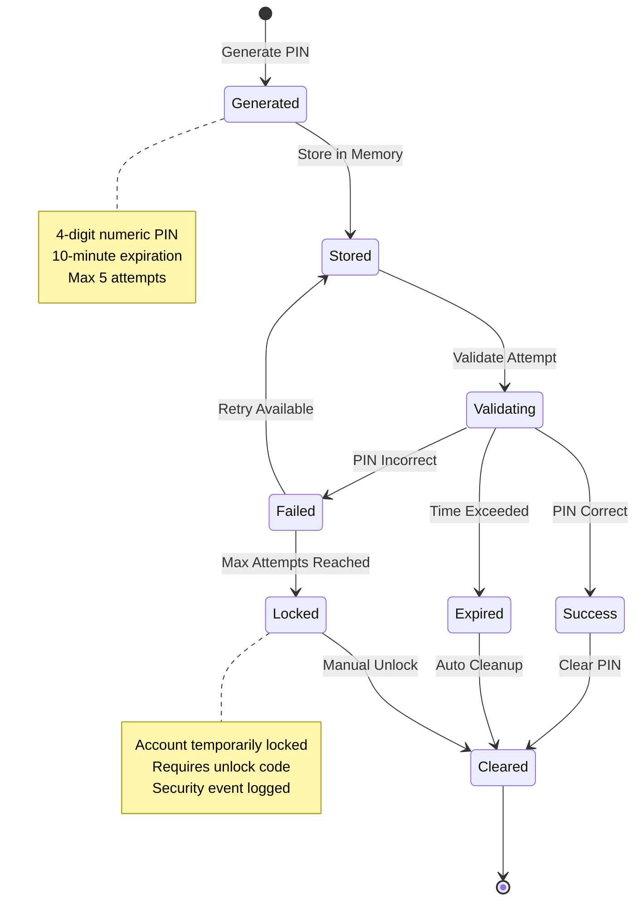

---
## 8. Account Recovery Flow
---

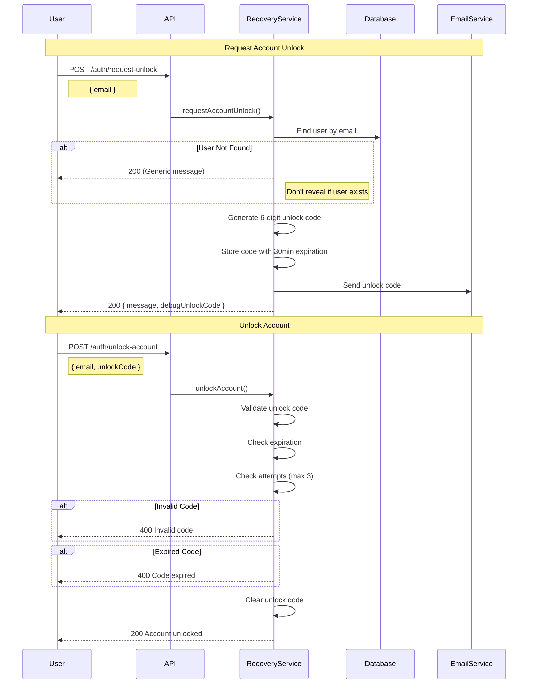

---
## 9. Database Schema
---

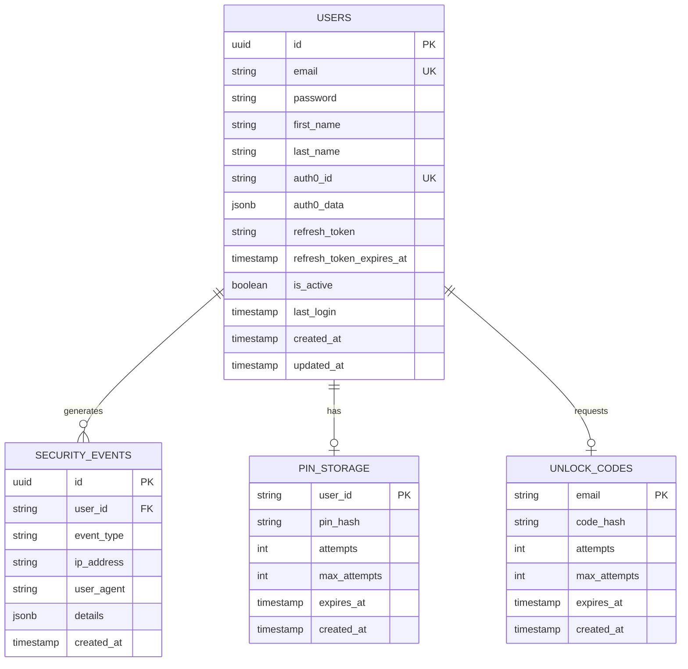

---
## 10. API Routes Structure
---

```mermaid
graph LR
    subgraph "Public Routes"
        HEALTH[/api/health]
        PING[/api/ping]
        STATUS[/api/status]
    end

    subgraph "Auth Routes - Legacy"
        REGISTER[/auth/register]
        VALIDATE_CRED[/auth/validate-credentials]
        VALIDATE_PIN[/auth/validate-pin]
        VALIDATE_LOC[/auth/validate-location]
        LOGOUT[/auth/logout]
        REFRESH[/auth/refresh-tokens]
    end

    subgraph "Auth Routes - Auth0"
        AUTH0_CALLBACK[/auth/auth0/callback]
        PROFILE[/auth/profile]
        UPDATE_PROFILE[/auth/profile]
        SYNC_PROFILE[/auth/profile/sync]
        DELETE_ACCOUNT[/auth/account]
    end

    subgraph "Security Routes"
        SEC_EVENTS[/auth/security/events]
        SEC_CLEANUP[/auth/security/cleanup]
    end

    subgraph "Recovery Routes"
        REQUEST_UNLOCK[/auth/request-unlock]
        UNLOCK[/auth/unlock-account]
    end

    subgraph "Protected Routes"
        ROOT[/]
        LEGACY[/legacy]
    end

    style HEALTH fill:#c8e6c9
    style REGISTER fill:#fff9c4
    style AUTH0_CALLBACK fill:#e1bee7
    style SEC_EVENTS fill:#ffccbc
    style REQUEST_UNLOCK fill:#b3e5fc
    style ROOT fill:#f8bbd0
```

---
## 11. Middleware Stack Flow
---

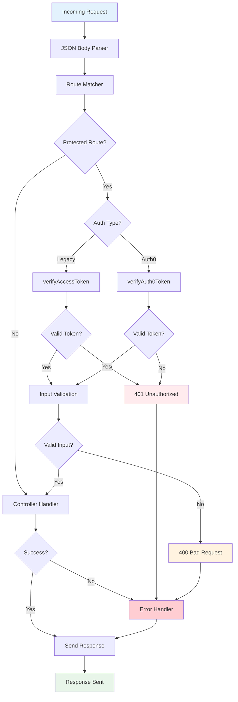

---
## 12. Service Layer Architecture
---

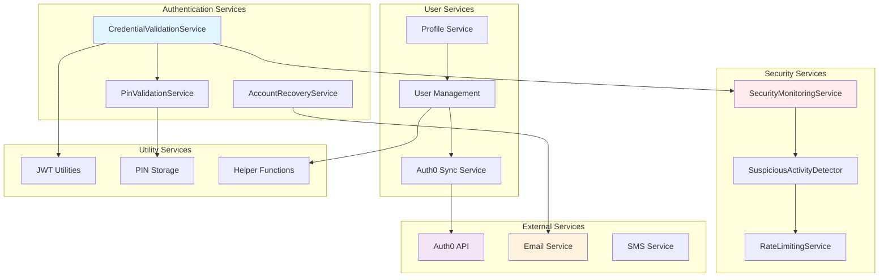

---
## 13. Error Handling Flow
---

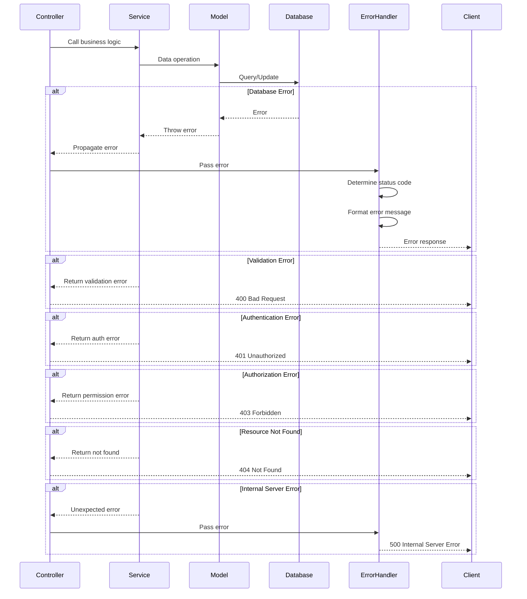

---
## 14. Data Flow Diagram
---

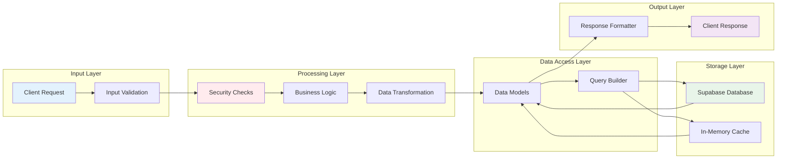

---
## 15. Deployment Architecture
---

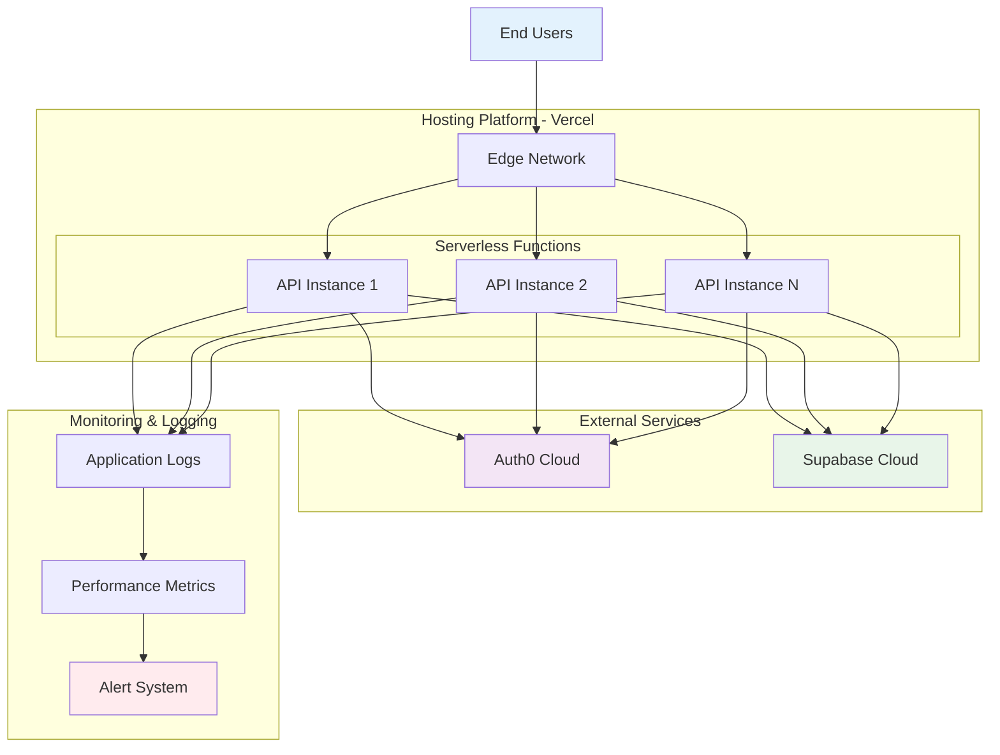

---
## 16. Complete Authentication State Machine
---

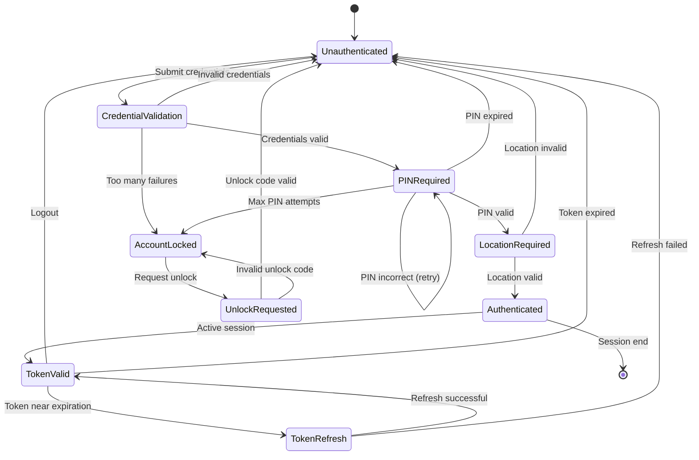

---
## Diagram Viewing Instructions
---

To view these diagrams:

1. **GitHub**: GitHub natively supports Mermaid diagrams in markdown files
   - Simply view this file on GitHub

2. **VS Code**: Install the "Markdown Preview Mermaid Support" extension
   - Open this file
   - Press Ctrl+Shift+V (or Cmd+Shift+V on Mac)

3. **Online**: Use Mermaid Live Editor
   - Visit: https://mermaid.live/
   - Copy and paste individual diagram code blocks

4. **Documentation Tools**: 
   - GitBook, Notion, Confluence all support Mermaid
   - Copy the diagram code blocks into your documentation

---
## Diagram Legend
---

**Colors:**
- Blue (#e1f5ff, #e3f2fd): Client/External interfaces
- Purple (#e1bee7, #f3e5f5): Auth0 related
- Green (#c8e6c9, #e8f5e9): Database/Storage
- Red (#ffebee, #ffcdd2): Security/Errors
- Orange (#fff3e0, #fff9c4): Processing/Logic
- Pink (#f8bbd0): Protected resources

**Symbols:**
- Rectangles: Processes/Services
- Rounded Rectangles: Components
- Diamonds: Decision points
- Cylinders: Databases
- Circles: Start/End points

